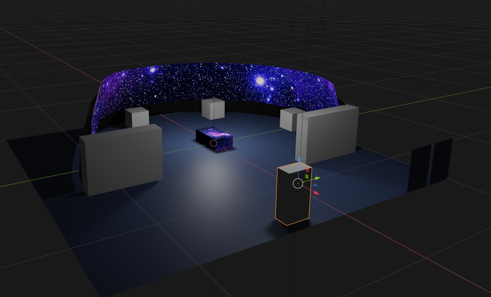

# Interstellar Space Station 

## Concept #1 - Planetarium Dome

1. The Anchor experience of this concept would be a large ceiling mounted projection dome not unlike a planetarium. This would have a passive exhibit experience projected during the day, but would be built in a way such that it could be 'switched' into a facilitated mode and have driven events by an educator (either as a demo for guests or for special events).
2. Underneath the dome would be various hands-on and interactive exhibit kiosks that explore the ideas and science behind studying and possibly venturing into the reaches of the galaxy beyond our solar system. 
* These exhbits could be interconnected in a narrative that convey a mission to explore from start to finish. Something like: 
* 1. Studying from afar with telescopes and sensors.
* 2. Sending probes and unmanned robotic vehicles to study.
* 3. Preparing a self sustaining colonizing ship to make the multi-generational journey.

An example of an exhibit that I think would do well here is Clark Planetarium's Stellar Playground - https://clarkplanetariumproductions.org/exhibits/stellarplayground

## Concept #2 - Hyperwall Variant

* This would basically be entirely the same as concept 1, except it would involve a Hyperwall wrap around the outside of the exhibit instead of a dome overtop.

## Concept #3 - Mission Control
1. The anchor experience of this concept would instead lean more heavily into making directly interconnected exhibits, a 'Multiplayer' experience. Different stations with different 'roles' would all run concurrently to allow the users to perform a fictionalized exploratory mission together. This would either:
* Require the area to happen on a timer not unlike a 'show'. I think this may add more problems than it solves.
* Have a constantly running mission that you can hop in and out of at your own will.
* Have a mission on a timer, but also have a secondary exhibit experience you can do at the kiosks while you wait for the next mission to start.

Programmatically I believe this third option to be the most complex to execute, but could be great if executed correctly. 

## Conclusion

Of these proposals I feel the strongest about the first one in terms of versatility of space and uniqueness of impact. Any or all of these ideas could be simplified depending on if the budget demands it, but these are the go big or go home concepts.

###### Jake Rudder

